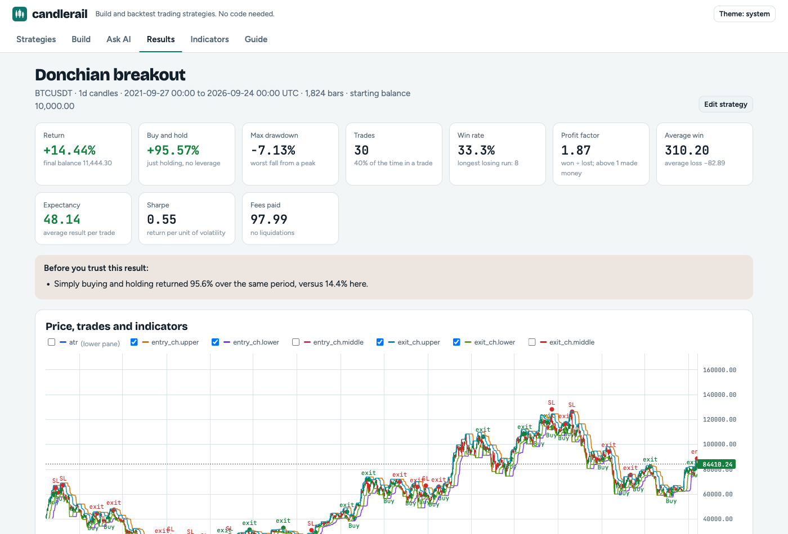

# candlerail

[](https://github.com/upendrx/candlerail/actions/workflows/ci.yml)
[](#license)

Build and backtest trading strategies without writing code. Pick indicators,
say when to buy and sell, choose your risk and leverage, and see how it would
have done, in plain English and with the numbers that matter.



```bash
cargo build --release
./target/release/candlerail serve        # then open http://127.0.0.1:8787
```

It runs entirely on your computer (Windows, macOS or Linux). Candles come
from Binance's public API with no account needed, or from any CSV file for
stocks, forex, futures or anything else.

## Three ways to make a strategy

**Start from a template.** Ten ready-made strategies (trend following, mean
reversion, breakouts, momentum, intraday). Each explains how it works, when
it works best, and when it fails.

**Use the builder.** Choose indicators from a list, then write rules like
*"RSI crosses below 30 **and** close is above the 200 SMA"* with dropdowns. A
summary in plain English updates as you go, so you always know exactly what
the strategy will do.

**Describe it to an AI.** Write what you want in your own words, copy the
generated prompt into any chat assistant, hosted or running locally, and paste the
reply back. The AI writes a strategy *file*, not code, so it can only use what
candlerail understands, and you read the summary before anything runs.

## What a strategy can do

- **14 indicators:** SMA, EMA, RSI, MACD, Bollinger Bands, ATR, stochastic,
  session VWAP, SuperTrend, ADX, OBV, Donchian channel, rate of change,
  Keltner channel.
- **Rules:** above, below, crosses above/below, rising and falling over N
  bars, values from N bars ago, combined with AND, OR and NOT.
- **Long, short or both**, with leverage from 1x to 125x.
- **Exits:** stop-loss and take-profit (by %, by ATR, or as a multiple of
  the risk), trailing stops, exit rules, time limits.
- **Position sizing:** risk a % of the account per trade, use a % as margin,
  or a fixed quantity.

## Honest backtests

A backtest that flatters a strategy is worse than none, so the simulation is
deliberately strict:

- Signals are decided at a candle's close and filled at the **next** open.
- If a candle touches your stop and your target, the **stop counts**.
- Every trade pays **fees and slippage** (0.1% and 0.02% by default).
- Leveraged positions have a **liquidation price**, and a trade that reaches
  it loses its margin.
- Results show **max drawdown, profit factor and buy-and-hold** next to the
  return, compare the first 70% of the period with the last 30% to catch
  overfitting, and warn in plain words when a result shouldn't be trusted.

[How backtests work](docs/backtesting.md) has the details.

## From the terminal

```bash
candlerail templates                                  # list the built-in strategies
candlerail backtest donchian-breakout                 # run one
candlerail new mine.json --from rsi-dip-uptrend       # copy one to edit
candlerail explain mine.json                          # read it back in plain English
candlerail backtest mine.json --symbol ETHUSDT --interval 4h --from 2024-01-01
candlerail backtest mine.json --csv my-stock.csv      # any market
candlerail prompt                                     # instructions for an AI assistant
```

## Documentation

- [Getting started](docs/getting-started.md)
- [A guide to strategy types](docs/strategy-guide.md): trend, mean reversion,
  breakout, momentum, intraday, and common mistakes
- [The strategy file](docs/strategy-format.md) and its [JSON Schema](schema/strategy.schema.json)
- [How backtests work](docs/backtesting.md)
- [Writing strategies with AI](docs/using-ai.md)
- [Architecture](docs/architecture.md), and how to add indicators and templates
- [Command reference](docs/cli.md) and [HTTP API](docs/api.md)
- [Development guide](docs/development.md): building, testing, code style, releases
- [Roadmap](docs/roadmap.md): live paper trading, alerts, desktop app, Python

## Status

candlerail backtests strategies on historical candles. Live paper trading
and alerts (desktop, Telegram, Discord, webhooks) are next on the
[roadmap](docs/roadmap.md). It never places real orders.

Past performance doesn't predict future results, and most people who trade
with leverage lose money. Nothing here is financial advice.

## Contributing

New indicators, templates, data sources and docs are all welcome. See
[CONTRIBUTING.md](CONTRIBUTING.md). candlerail is a sibling of
[tickrail](https://github.com/upendrx/tickrail), a tick-level engine for
low-latency trading.

## License

Licensed under either of [Apache License 2.0](LICENSE-APACHE) or
[MIT license](LICENSE-MIT), at your option. Charts use TradingView
Lightweight Charts; see [THIRD_PARTY_NOTICES.md](THIRD_PARTY_NOTICES.md).
