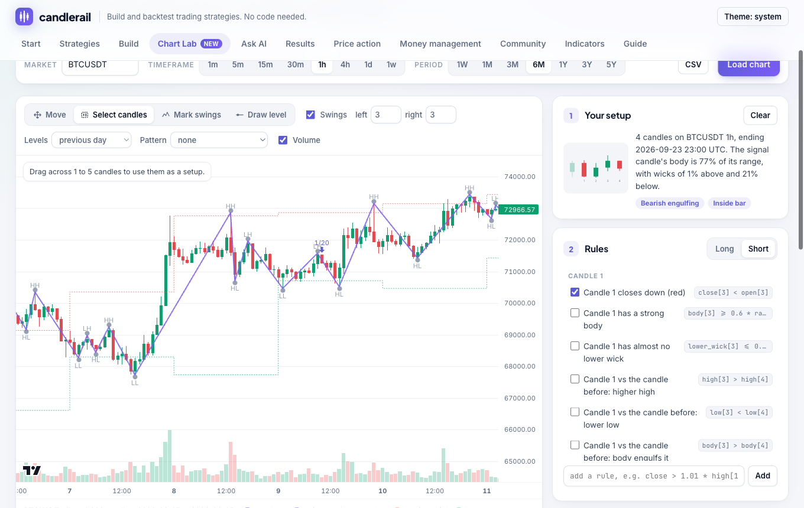

# Chart Lab

The Chart Lab is where you build price-action setups by looking at a chart
instead of writing rules. Select the candles you'd trade, and the lab turns
their shape into rules, marks every other time the same thing happened,
shows what price did afterwards, and backtests it on any market and
timeframe.

## Load a chart

Pick a Binance pair (or open a CSV of your own candles), a timeframe from
1 minute to 1 week, and a period from a week to five years. Periods that
would load more than 60,000 candles are disabled for short timeframes.

The chart shows:

- **Swings**: a zigzag through confirmed swing highs and lows, labelled
  `HH`, `LH`, `HL` and `LL`. `left` and `right` set how many candles a swing
  must stand out from; they're the same settings as the `swings` indicator.
  Swings are drawn where they happened, but a strategy only knows about one
  `right` candles later.
- **Levels**: the previous day's, week's or month's high and low as steps.
- **Pattern**: every candle that completes one of the 13 named patterns.
- **Volume** at the bottom.

Hover any candle to see its open, high, low and close, and what share of its
range is body and wick.

## Tools

| Tool | Key | What it does |
|---|---|---|
| Move | `V` | Drag to scroll, wheel to zoom |
| Select candles | `S` | Drag across 1 to 5 candles to make them your setup |
| Mark swings | `M` | Click above a candle for a swing high, below for a swing low |
| Draw level | `L` | Click to draw a horizontal level, drag it to move, double-click to delete |

`Esc` clears the selection; `←` and `→` step through matches.

## From candles to rules

When you select candles, the lab describes each one and the way it relates
to the candle before it, and lists every description as a rule you can
switch on or off:

- **Shape:** closes up or down, strong or small body, tiny body (doji), long
  or missing wicks. Rules are proportions of the candle's range, such as
  `lower_wick >= 0.4 * range`, so they match the shape at any price.
- **Compared with the candle before:** higher or lower high and low, closes
  beyond its high or low, body engulfs it, range much bigger or smaller.
- **Where it happens:** near swing support or resistance, breaking through
  it, market structure up or down, relative to yesterday's high and low, a
  volume spike. These are ticked when your example had them.
- **Named pattern:** if the selection completes a hammer, an engulfing or
  another named pattern, you can require that exact pattern.
- **Your levels:** a rule that the candle touches a level you drew. Drawn
  levels are fixed prices, so they only mean something on that market.
- **Your rules:** type any rule, such as `close > 1.01 * high[1]` or
  `vol.relative > 2`.

For a multi-candle selection, the signal candle (the last one) starts with
its whole shape switched on, and the earlier candles with just their
direction. Candles are numbered left to right in the preview, and rules for
earlier candles use `[n]` offsets (`close[2]` is two candles before the
signal).

The direction (long or short) starts from the signal candle's colour.

## Every time it happened

As rules change, the lab asks the engine for every candle where they all
hold, marks them with arrows, and counts them. `‹` and `›` step through them
on the chart. If there are too few to learn anything, **Too few? Loosen**
switches off the least central rules one at a time until there are enough.

For each match it measures what price did over the next *N* candles (the
slider), entering at the next candle's open as a real trade would:

- **Went your way**: the share of matches that were up (for longs) after N
  candles, next to the same figure for *any* candle. A setup is only
  interesting if it beats that baseline.
- **Average and median move**, the **average run in your favour and
  against you** within those candles, and the best and worst.
- A chart of the average path after a match, with the middle half of
  outcomes shaded and the any-candle average dashed.

These figures have no stops and no costs. They show whether the setup has
any tendency at all, before you decide how to trade it.

## Trade it

Choose a stop (just beyond the setup's extreme candle, just beyond the
signal candle, or 1.5 ATR), a target (1R, 2R, 3R or the next swing), and a
time limit, then **Backtest**. The result uses the same engine and costs as
every other backtest: next-open fills, 0.1% fees and 0.02% slippage per
fill, 1% of the account risked per trade. Exits are marked on the chart, and
**Full report** opens the Results tab.

If the stop on your example is so close that costs are a large part of the
risk, the lab says so. A stop 0.3% away with 0.24% round-trip costs loses
about 0.8R to costs on every trade, which is why many 1-minute and 5-minute
setups fail.

**All timeframes** runs the same rules on 5m, 15m, 1h, 4h and 1d, each over
its default period. **Other coins** runs them on BTC, ETH, SOL, BNB and XRP
over the same period. A setup that works on one row only is probably luck.

**Open in builder** and **Copy JSON** give you the strategy file, with every
rule written out, to edit, save or share. **Save setup** keeps the setup in
this browser, so you can load it later on another chart or timeframe.

## Mark swings the way you see them

Traders disagree on what counts as a swing. Mark a few highs and lows the
way you see them with **Mark swings**. With three or more marks, the lab
tries every `left` and `right` from 1 to 10 and tells you which setting
finds your swings with the fewest extra ones, for example *"left 4, right 2:
finds 8 of your 9 swings and adds 1 you didn't mark"*. **Use** applies it to
the chart and to any swing rules in your setup.
