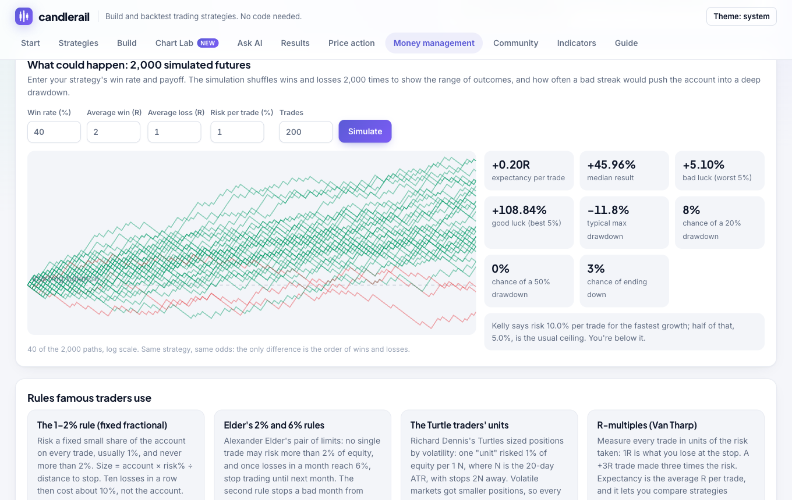

# Money management

Money management decides how much of the account each trade puts at risk,
and when to stop trading. Two traders with the same entries can end up very
differently depending on it. The app's **Money management** tab has
calculators and a simulation; this page explains the ideas and how they map
to strategy files.



## Risk per trade

Decide what you lose if the stop is hit, as a share of the account, and
size the position from that:

```text
position size = account × risk % ÷ distance from entry to stop
```

With a $10,000 account, 1% risk, an entry at 100 and a stop at 97, you risk
$100 and $3 per share, so you buy 33 shares. A wider stop means a smaller
position; the money at risk stays the same.

In a strategy file:

```json
"sizing": { "type": "risk_percent", "value": 1 },
"exit": { "stop_loss": { "below": "low" } }
```

`risk_percent` needs a stop-loss, by percent, ATR or price level.

### Forex, futures and other markets

| Market | Size in | Formula |
|---|---|---|
| Stocks, ETFs, crypto | Shares or coins | risk ÷ (entry − stop) |
| Forex | Lots (1 standard lot = 100,000 units) | risk ÷ (pips to stop × value per pip per lot); about $10 a pip per lot on EURUSD |
| Futures | Contracts | risk ÷ (points to stop × value per point), rounded down; E-mini S&P 500 is $50 a point |

The position calculator on the Money management tab does all four.

## Well-known rules

| Rule | What it says | In candlerail |
|---|---|---|
| **The 1–2% rule** (fixed fractional) | Risk a fixed small share of the account per trade, usually 1%, at most 2% | `sizing.risk_percent` |
| **Elder's 2% and 6% rules** | No trade risks more than 2%; stop for the month once monthly losses reach 6% | `risk_percent` ≤ 2, `risk.monthly_loss_percent: 6` |
| **Turtle units** | Size by volatility: a unit risks 1% per 1 ATR, stop 2 ATR away | `risk_percent: 1` with `stop_loss: { "atr": 2 }` |
| **R-multiples** (Van Tharp) | Measure every result in units of the risk taken; expectancy is the average R | Every trade's `r_multiple`, and `avg_r` in the metrics |
| **Kelly criterion** | The risk fraction that maximises long-run growth: f = W − (1 − W) ÷ R | `kelly_risk_pct` in the metrics |
| **Fixed ratio** (Ryan Jones) | For whole contracts: add one each time profit grows by a set "delta" × contracts held | Use the futures calculator |
| **Daily loss limit** | Stop for the day after losing a set % | `risk.daily_loss_percent` |
| **Maximum drawdown** | Stop trading altogether after falling a set % from the peak | `risk.max_drawdown_percent` |

**Kelly** uses the win rate W and the payoff ratio R (average win ÷ average
loss, both in R). With a 40% win rate and 2R winners, f = 0.4 − 0.6 ÷ 2 =
10%. Full Kelly is violent and assumes your statistics are exact; traders
use half or less. candlerail reports Kelly once a test has at least ten
trades with a stop, and warns if you're risking more than half of it. A
negative Kelly means no position size makes the strategy profitable.

**Martingale** (doubling the size after a loss) is deliberately not
supported. A long enough losing streak always comes, and it ends the
account. `pause_after_losses` does the opposite: it steps back after a
streak.

## Reward, risk and win rate

| Risk : reward | Break-even win rate |
|---|---|
| 1 : 1 | 50% |
| 1 : 1.5 | 40% |
| 1 : 2 | 33.3% |
| 1 : 3 | 25% |

Costs raise these. With a 2% stop, a 4% target and 0.2% round-trip costs,
you need to win 36.7% of the time, not 33.3%.

Losses compound against you:

| Drawdown | Gain needed to recover |
|---|---|
| −10% | +11.1% |
| −20% | +25% |
| −30% | +42.9% |
| −50% | +100% |
| −75% | +300% |

## Account limits

The `risk` section of a strategy applies the limits a trading desk would:

```json
"risk": {
  "daily_loss_percent": 3,
  "monthly_loss_percent": 6,
  "max_drawdown_percent": 20,
  "max_trades_per_day": 4,
  "pause_after_losses": 3,
  "pause_bars": 24
}
```

When a loss limit is hit, open positions close at the next open (exit
reason `risk_limit`) and entries wait for the next day or month. The
drawdown limit stops trading for the rest of the test. Results list how
many entries each rule blocked. The field reference is in
[the strategy file](strategy-format.md#money-management-rules).

The Money management tab has three presets:

| Preset | Risk / trade | Daily | Monthly | Drawdown | Other |
|---|---|---|---|---|---|
| Conservative | 0.5% | 2% | 5% | 15% | 3 trades a day, pause 24 candles after 3 losses |
| Elder 2% / 6% | 2% | | 6% | | |
| Prop-firm style | 0.5% | 5% | | 10% | pause 12 candles after 3 losses |

## Across markets

The more a market moves, the smaller the position for the same risk.

| Market | Typical daily move | Common risk per trade |
|---|---|---|
| Large-cap stocks and ETFs | 1–2% | 0.5–1% |
| Forex majors | 0.5–1% | 0.5–1% |
| Crypto | 3–5% or more | 0.25–1% |
| Index futures | 1–2% | 0.5–1% |
| Commodities | 1–3%, with gaps | 0.5–1% |

- **Correlated positions count as one.** Three tech stocks, or BTC, ETH and
  SOL together, are close to one big bet. Add up their risk.
- **Cap total open risk.** A common ceiling is 5–6% of the account at risk
  across all open trades.
- **Cap each sector** at roughly 20–25% of exposure.
- **Size down when volatility rises.** If the daily range doubles, halve the
  position, as the Turtles did.
- **Leverage is a reason to risk less.** Forex and crypto offer huge
  leverage, which is why traders there usually risk less per trade, not more.

These are common guidelines, not personal advice.

## Simulating the future

The Monte Carlo panel on the Money management tab takes a win rate, the
average win and loss in R, and the risk per trade, and plays 2,000 random
orderings of wins and losses. It shows the typical result, the bad-luck and
good-luck cases, and how likely a 20% or 50% drawdown is. Use the numbers
from a backtest (win rate and average R) to see how much of a result was the
edge and how much was the order the trades came in.
