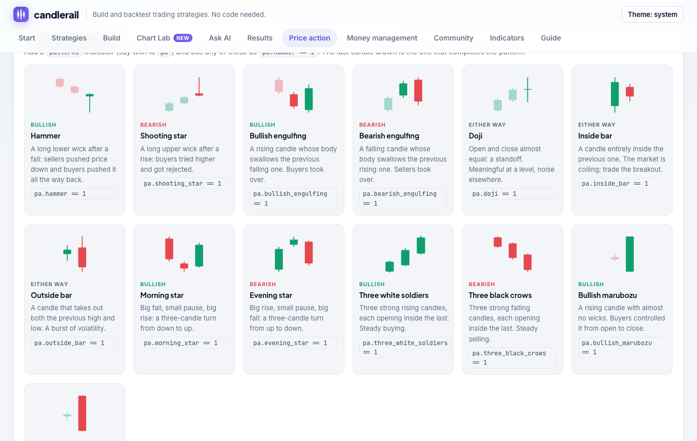

# Price action

Price action trading uses price itself, with no indicators that smooth or
transform it. It asks three questions: where are buyers and sellers
defending (support and resistance), which way is the market stepping
(structure), and what did this candle just show (its shape). The app's
**Price action** tab covers the same ground with drawings; this page is the
reference.



## One candle

Every candle gives these values to rules, with no indicator needed:

| Value | Meaning |
|---|---|
| `open`, `high`, `low`, `close`, `volume` | The candle itself |
| `body` | `|close − open|`, the size of the move |
| `range` | `high − low`, the whole extent |
| `upper_wick` | `high − max(open, close)`: how far buyers pushed before being rejected |
| `lower_wick` | `min(open, close) − low`: how far sellers pushed before being rejected |

Combine them with numbers in **formulas**:

| Idea | Rule |
|---|---|
| Bullish candle | `close > open` |
| Strong candle | `body >= 0.7 * range` |
| Rejection wick (buyers pushed back) | `lower_wick >= 2 * body` |
| Range expansion | `range > 1.5 * range[1]` |
| Higher high and higher low | `high > high[1]` and `low > low[1]` |
| Close above the previous high | `close > high[1]` |
| Three higher closes | `close` `rising` `3` |

## Levels

| Indicator | Gives you |
|---|---|
| `swings` | `support` and `resistance`: the latest confirmed swing low and high. Also the ones before them and `structure` |
| `period` | Higher-timeframe levels on any chart: the previous hour, 4 hours, day, week or month's open, high, low and close, plus the current period's so far |
| `opening_range` | The high and low of each session's first minutes |
| `volume_avg` | `relative` volume: 2 means twice the recent average |

A swing high is a candle whose high is above the `left` candles before it
and not exceeded by the `right` candles after it, so it's only known `right`
candles later. The engine only uses it from that point on, so a backtest
never trades on a swing it couldn't have seen yet.

`swings.structure` is 1 when the latest swing high and swing low are both
higher than the ones before (an uptrend by price action), −1 when both are
lower, and 0 when they disagree.

## Multi-timeframe

`period` brings higher-timeframe candles onto any chart. Trade 5-minute
candles against yesterday's range, or daily candles against last month's:

```json
"indicators": {
  "day":   { "type": "period", "minutes": 1440 },
  "week":  { "type": "period", "minutes": 10080 },
  "month": { "type": "period", "minutes": 43200 }
}
```

| Idea | Rule |
|---|---|
| Above yesterday's high | `close > day.prev_high` |
| Weekly trend is up | `close > week.prev_close` |
| Breaking last month's high | `close` `crosses_above` `month.prev_high` |
| Inside yesterday's range | `high < day.prev_high` and `low > day.prev_low` |
| Today's range so far is small | `day.high - day.low < 0.5 * day.prev_high - 0.5 * day.prev_low` |

Days, weeks and months are in UTC. Weeks start on Monday; months are
calendar months.

## Patterns

Add a `patterns` indicator and use any output as a flag: 1 on the candle
that completes the pattern, 0 otherwise.

```json
"indicators": { "pa": { "type": "patterns" } },
"entry": { "long": { "left": "pa.hammer", "op": "==", "right": 1 } }
```

| Output | Shape |
|---|---|
| `hammer` | Lower wick at least `wick_ratio` × the body, small upper wick |
| `shooting_star` | The mirror: long upper wick, small lower wick |
| `doji` | Body at most `doji_percent` % of the range |
| `bullish_engulfing` | A rising candle whose body covers the previous falling candle's body |
| `bearish_engulfing` | The mirror |
| `inside_bar` | High and low both inside the previous candle's |
| `outside_bar` | High and low both beyond the previous candle's |
| `morning_star` | Big falling candle, small candle, rising candle closing past the first one's midpoint |
| `evening_star` | The mirror |
| `three_white_soldiers` | Three strong rising candles, each opening inside the previous body and closing higher |
| `three_black_crows` | The mirror |
| `bullish_marubozu`, `bearish_marubozu` | A body of at least 90% of the range |

Patterns alone are weak signals. They matter at a level: a hammer in the
middle of nowhere is noise; a hammer that rejects last week's low is a setup.

## Building your own setup in four questions

1. **Where?** At which level does the idea make sense? A swing low,
   yesterday's high, the opening range, last month's high.
   `low <= 1.003 * sw.support`
2. **What happened there?** A rejection candle, an engulfing, a close
   through the level. `pa.hammer == 1`
3. **Any confirmation?** Structure on your side, a volume spike, a candle
   bigger than usual. `vol.relative > 1.5`
4. **Where am I wrong?** Put the stop where the idea is invalid, under the
   candle or the level, and the target at the next level or at 2R.

```json
"exit": {
  "stop_loss":   { "below": "low - 0.1 * range" },
  "take_profit": { "above": "sw.resistance" }
}
```

### Worked example: buy a rejection of yesterday's low

Price dips under yesterday's low, then closes back above it with a long
lower wick, on more volume than usual. The idea is wrong if price trades
back under the wick. The target is twice the risk.

```json
{
  "name": "Yesterday's low rejection",
  "market": { "symbol": "BTCUSDT", "interval": "1h" },
  "indicators": {
    "pd":  { "type": "period", "minutes": 1440 },
    "vol": { "type": "volume_avg", "period": 20 }
  },
  "entry": { "long": { "all": [
    { "left": "low",          "op": "<",  "right": "pd.prev_low" },
    { "left": "close",        "op": ">",  "right": "pd.prev_low" },
    { "left": "lower_wick",   "op": ">=", "right": "2 * body" },
    { "left": "vol.relative", "op": ">",  "right": 1.3 }
  ] } },
  "exit": {
    "stop_loss": { "below": "low - 0.1 * range" },
    "take_profit": { "risk_multiple": 2 },
    "max_bars": 48
  },
  "sizing": { "type": "risk_percent", "value": 1 },
  "risk": { "daily_loss_percent": 3, "max_drawdown_percent": 20 }
}
```

The **Price action** tab has this example with *Open in the builder* and
*Backtest it* buttons. Try other levels (`pd.prev_high` for shorts, a weekly
`period`), other confirmations, and other timeframes, and see which hold up
on the second half of the data.

## Templates

| Template | Timeframe | Idea |
|---|---|---|
| `pa-scalp-micro-breakout` | 1m | Break of a tiny swing high on a volume spike, out fast |
| `pa-opening-range-breakout` | 5m | Break of the session's first 30 minutes, long or short |
| `pa-previous-day-breakout` | 15m or 1h | Close above yesterday's high on strong volume |
| `pa-pin-bar-support` | 1h or 4h | Hammer rejecting the latest swing low, target the swing high |
| `pa-engulfing-structure` | 4h | Engulfing candles in the direction of market structure |
| `pa-inside-bar-breakout` | 4h or 1d | Break of an inside bar, stop at the other side |
| `pa-morning-star-support` | 4h or 1d | Morning star at the latest swing low |
| `pa-monthly-level-breakout` | 1d | Close above last month's high, trailing stop |

Run any of them with `candlerail backtest pa-pin-bar-support`, or from the
**Strategies** tab (filter *Price action*). Several of them lose money on
recent crypto data once fees are counted. They are starting points to
study and change, not finished systems.

## Scalping

1-minute strategies make many trades, so costs dominate. A 0.1% fee per
fill is 0.2% per round trip, which is more than the typical 1-minute move.
Before trusting a scalp, set the fee your exchange really charges (maker
rebates, VIP tiers) and keep slippage realistic. If the strategy only works
with zero costs, it doesn't work.
