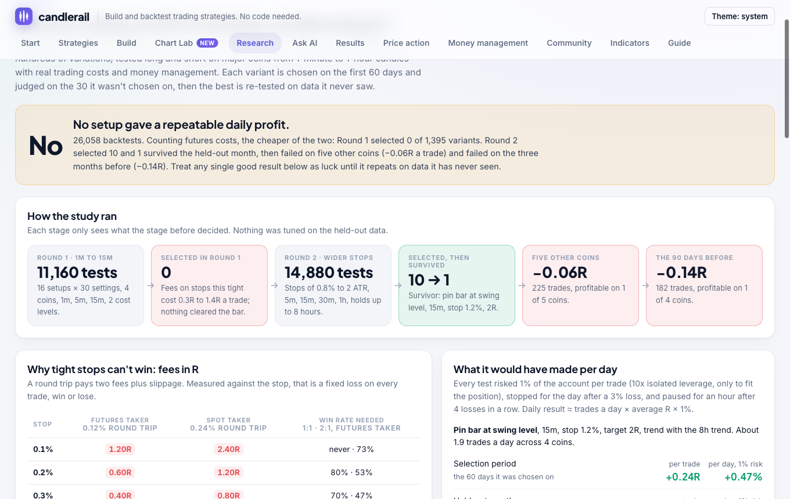

# Research

Each study asks one question, tests hundreds of strategy variants on real
Binance data with real trading costs, chooses variants on one period by a
rule fixed in advance, and then checks them on data they never saw. The
app's **Research** tab shows every study with the same numbering and an
explorer for every variant.



| Page | Question or test | Result |
|---|---|---|
| **1** | Day trading on 1- to 15-minute candles | **No setup gave a repeatable daily profit** |
| 1.1 | Round 1: 1m, 5m, 15m | 0 of 1,395 selected; fees 0.3R to 1.4R a trade |
| 1.2 | Round 2: wider stops | 10 selected, 1 survived the held-out month |
| 1.3 | Survivor on five other coins | −0.06R a trade |
| 1.4 | Survivor on the 90 days before | −0.14R a trade |
| **2** | Monthly profit from swing and trend trading with $500 to $1,000 | **Trend following on 4h held up in three different markets** |
| 2.1 | 11 strategies, 10 coins, 1h/4h/1d, 3 years | 230 selected, 44 survived a year when holding lost 41% |
| 2.2 | The survivors on 2020 to 2023 | All 44 made money on data they never saw |
| 2.3 | Funding-rate carry | About 3% a year recently, 6% to 7% in 2020 to 2023 |
| 2.4 | How traders use AI, for free | Search and honest testing, not predictions |
| **3** | How quants scale up, and what a lone trader with a bot can use | **Trend plus coin rotation: about +4% a month, largest fall about 20%** |
| 3.1 | How much to risk | Returns and drawdowns scale together |
| 3.2 | Coin rotation across 43 coins | 204 of 540 selected, 138 survived |
| 3.3 | Fear & Greed sentiment | Survivors are mostly the trend filter |
| 3.4 | Time of day and day of week | Hour patterns reversed out of sample, even before costs |
| 3.5 | Pairs trading | No pair survived costs |
| 3.6 | Combining strategies | Correlation 0.46: together they fall far less than either alone |

# Study 1: intraday reversals on major coins

Can well-known day-trading setups, mostly candle reversals at support and
resistance, make a daily profit on BTC, ETH, SOL and XRP once real trading
costs are paid?

**Short answer: no setup held up.** About 26,000 backtests found one variant
that passed selection and a held-out month, and it lost money on five other
coins and on the three months before.

## 1. The setups

Fifteen setups, each traded long and short, plus an opening-range breakout
as a trend-following reference:

| Setup | Long side (short mirrors it) |
|---|---|
| Engulfing at swing level | Bullish engulfing within half an ATR of the latest swing low |
| Pin bar at swing level | Hammer that holds the latest swing low |
| Liquidity sweep and reclaim | Low runs below the swing low, close back above it, long lower wick |
| Small candle, then big breakout candle | Inside bar, then a candle 1.5× its range closing above it |
| Morning star at swing level | Morning star whose middle candle sits at the swing low |
| Outside-bar reversal | After three falling closes, an outside bar closing above the previous high |
| Previous hour / 4-hour / day rejection | Dip under the previous period's low, close back above with a long lower wick |
| Reversal far from VWAP | Two ATRs below the day's VWAP, then an engulfing or hammer |
| Bollinger band reclaim | Pierce the lower band, close back inside, up |
| Engulfing out of an RSI extreme | RSI below 30 on the previous candle, then a bullish engulfing |
| Pullback in a trend | 20 EMA above 50, dip to the 20, engulfing or hammer |
| Big, small, big back | Large red candle, small candle, strong green candle above the small one |
| Change of character | In a structure of lower highs and lows, a close above the last swing high |

Every setup was crossed with a stop (beyond the signal candle, ATR multiples
or a fixed percentage), a target of 1, 1.5 or 2 times the risk, and either
no trend filter or trading only with an 8-hour EMA. Every trade risked 1% of
the account (10x isolated leverage, only so the position fits), with a 3%
daily loss limit and a one-hour pause after four losses in a row. Trades
closed after 4 hours (round 1) or 8 hours (round 2).

## 1. Method

- **Data:** Binance candles for the 90 days to 27 September 2026.
- **Fills:** signal at a candle's close, market order at the next open, stop
  before target when a candle touches both.
- **Costs:** *futures taker* 0.05% fee and 0.01% slippage per fill; *spot
  taker* 0.1% and 0.02%. Futures funding isn't included.
- **Selection, fixed before looking:** a variant is *selected* if it trades
  often enough, averages at least +0.05R over the first 60 days, and makes
  money there on at least 3 of the 4 coins. It *survives* if it then averages
  above 0R over the last 30 days and makes money on at least 3 coins.
- **Trend:** each trade is tagged by the coin's change over the 24 hours
  before it: above +1.5% is an uptrend, below −1.5% a downtrend, else sideways.

## 1. Results

### 1.1 Round 1: 1, 5 and 15-minute candles

465 variants × 4 coins × 3 timeframes × 2 cost levels: **11,160 backtests**.
Of the 1,395 variant-timeframe combinations under futures costs, 7 averaged
above zero in the selection period and **none was selected**.

The reason is costs. Fees alone, as a multiple of each trade's risk:

| Timeframe | Median fees per trade, futures | Spot |
|---|---|---|
| 1m | 1.38R | 2.40R |
| 5m | 0.50R | 0.96R |
| 15m | 0.33R | 0.67R |

A 0.1% stop with a 0.2% target pays 1.2R per round trip on futures, and needs
to win 73% of the time just to break even. Before costs, the best setups
averaged only +0.1R to +0.3R.

### 1.2 Round 2: wider stops

Informed only by the cost result: stops of 0.8%, 1.2%, 1.5 ATR, 2 ATR or
beyond the signal candle, 5 to 60-minute candles, holds of up to 8 hours, and
at least 1.5 trades a day counted across the four coins together. **14,880
backtests.** Under futures costs, 73 of 1,860 combinations were positive in
the selection period, **10 were selected and 1 survived**:

> **Pin bar at swing level**, 15-minute candles, 1.2% stop, 2R target, only
> with the 8-hour trend: +0.24R a trade in the selection period, +0.11R in
> the held-out month, profitable there on 3 of 4 coins, about 1.9 trades a
> day across the four.

Its trades by market trend: +0.59R in uptrends, +0.15R sideways, −0.09R in
downtrends.

### 1.3 and 1.4 Confirmation on data it never saw

| Test | Trades | Average | Coins profitable |
|---|---|---|---|
| Held-out month (round 2) | 66 | +0.11R | 3 of 4 |
| Five other coins (BNB, DOGE, ADA, AVAX, LINK), same 90 days | 225 | **−0.06R** | 1 of 5 |
| The same four coins, the 90 days before | 182 | **−0.14R** | 1 of 4 |

At 1% risk that is roughly +0.47% a day in the period it was chosen on,
+0.21% in the held-out month, and −0.15% and −0.28% a day on unseen data.
The survivor was luck.

## 1. What it means

- **Don't scalp at taker fees.** No candle pattern here had an edge close to
  what 1- and 5-minute stops pay in fees.
- **Candle reversals at support and resistance showed no reliable edge** on
  these coins in these months, even with wide stops.
- **A good backtest isn't evidence until it repeats** on data it wasn't
  chosen on. A study that tests thousands of variants will always find some
  that look good.
- Worth testing next: entries with limit orders at the maker fee, fewer and
  longer trades where costs are a small share of the risk, and repeating
  this study as new months arrive.

# Study 2: monthly profit from swing and trend trading

With $500 to $1,000, trading most days but judged by the month, which
strategies on Binance coins actually made money, and how much?

**Short answer: trend following on 4-hour candles did, modestly.** The
variants that survived a falling year also made money on the three years
before, which none of them had seen.

## 2.1 Eleven strategies on ten coins

| Kind | Strategies |
|---|---|
| Trend | Donchian channel breakout (20/10 and 55/20), EMA crossover (10/30, 20/50, 50/200), SuperTrend flip, price crossing its 50/100/200-candle average, weekly high/low breakout, Keltner channel breakout, MACD cross with the 200 EMA |
| Mean reversion | Connors' RSI(2) pullback above the 200 average, Bollinger reversion when ADX is below 20, RSI(14) pullback in a trend |
| Reversal | Study 1's pin bar at a swing level, with the 200 EMA and a 2R target |

Each is tested long-only (spot) and long and short (futures), with a 2 or
3 ATR stop, with or without a 3 ATR trailing stop, on BTC, ETH, SOL, XRP,
BNB, DOGE, ADA, AVAX, LINK and LTC at 1 hour, 4 hours and 1 day: 7,440
backtests. Every trade risks 2% of that coin's tenth of the account, with
no leverage. Variants are chosen on September 2023 to September 2025 and
judged on the year to September 2026, when buying and holding the same
coins lost about 41%.

**230 variants were selected and 44 survived.** Most selected long-only
rules failed in the falling year; the survivors are mostly long-and-short
trend followers on 4-hour candles.

## 2.2 The survivors on 2020 to 2023

All 44 survivors, unchanged, on the same coins over the three years before:
the 2021 bull market and the 2022 crash. **Every one made money**, on 6 to
10 of the 10 coins. Buying and holding made far more in those years (the
sum of its monthly returns was about +438%); the rules earned their place by
losing little when the market fell.

## 2.0 The picks

Among variants positive in all three periods and at most 18 months below a
previous peak, the best ratio of average month to largest fall:

| | Futures, long and short | Spot, long only |
|---|---|---|
| Rule, on 4-hour candles | SuperTrend (10, 3) flips: long when it turns up, short when it turns down; 2 ATR stop | Close above the upper Keltner channel (20 EMA + 2 × ATR 10); exit below the middle line; 3 ATR stop |
| Average month, 73 months | +2.5% | +1.2% |
| Months that made money | 40 of 73 | 35 of 73 |
| Worst month | −9.1% | −4.0% |
| Largest fall from a peak | −17.8% | −14.4% |
| Longest below a peak | 13 months | 10 months |
| Trades a month, 10 coins | about 28 | about 20 |

On $500 the futures pick's average month is about $12, and its worst month
about −$45. Returns scale roughly with risk. Coins that collapsed (LUNA,
FTT) aren't in the test, which flatters every strategy, buy and hold
included.

## 2.3 Funding-rate carry

Long spot and short the same amount of the perpetual future, half the
account in each leg, collecting funding every eight hours, with fees and
slippage on both legs:

| Period | Held all the time | Only while 7-day funding is positive | Months that made money |
|---|---|---|---|
| Sep 2023 to Sep 2026 | +3.1% a year | +2.0% a year | 32 of 37 |
| Sep 2020 to Sep 2023 | +6.2% a year | +6.7% a year | 28 of 37 |

Steady but small: about $1.30 a month on $500 recently. Funding history
comes from Binance's public futures API:

```bash
candlerail carry --days 1095 -o carry.json
candlerail carry --days 1095 --offset-days 1095      # the three years before
```

## 2.4 AI without a paid API

Most "AI trading bots" are ordinary rules with an AI label. What quantitative
traders use machine learning for is searching many rules and testing them
honestly, which is what `candlerail study` does locally. Free chat
assistants or local models (Ollama, LM Studio) can write strategy files
from the Ask AI tab's prompt; test anything they write here before trading
it.

# Study 3: how quants scale up

Where do the big algorithmic profits come from, which other signals help,
and what can one account running a bot realistically do?

Most large daily profits in crypto come from businesses a lone trader can't
copy: market making with fee rebates, speed arbitrage between exchanges,
and funding and basis trades run with millions at the lowest fee tiers.
What one account can use is the professional method: several uncorrelated
edges, sized together.

All tests use daily data from January 2020 (hourly from September 2020 for
time of day), choose on the years before July 2024 and judge on the years
after. **Selected** means a Sharpe ratio of at least 1 and at least 15% a
year before the split; **survived** means a Sharpe of at least 0.5 and a
profit after it. The coin universe has 43 Binance coins, including ones that
collapsed or were delisted (FTT, LUNA, SRM, MATIC, FTM, EOS), so holding a
dying coin counts.

## 3.2 Coin rotation

Every 1, 7 or 14 days, rank the coins by their return over 7 to 90 days
and hold the top 3, 5 or 10 (long-only on spot), or also short the bottom
ones (futures), optionally only while BTC is above its 50- or 100-day
average. 540 variants: **204 selected, 138 survived.** Long-only with a BTC
trend filter did best; buying the weakest coins (reversal) and long-short
did not. The weekly pick (30-day lookback, top 5, BTC above its 100-day
average) made about 74% a year after the split against 14% for BTC, with a
largest fall of about 50%.

```bash
candlerail quant research/rotation.json -o rotation.json
```

## 3.3 Fear & Greed sentiment

The free daily Crypto Fear & Greed index (alternative.me) timing BTC and
ETH: buy extreme fear, buy only while below a greed cap, buy fear in an
uptrend, or short greed in a downtrend. 186 variants, 31 selected, 17
survived, but the best survivors are a plain trend filter with the greed
cap switched off, or "buy when the index is under 50 in an uptrend".
The index itself added little.

## 3.4 Time of day and day of week

Learn the best hours or weekdays for BTC and ETH before the split and hold
only then. With futures costs no hour-based variant made money even in the
selection period; with no costs at all, the best hours had a Sharpe above 2
before the split and **lost money after it**. The patterns were noise.
Weekday variants that survived are mostly just holding the market four or
five days a week.

## 3.5 Pairs trading

For pairs whose daily returns were correlated above 0.75 before the split
(BTC/ETH, BTC/LTC, ETH/LTC, XRP/XLM, LTC/BCH), short the one that ran ahead
and buy the laggard when their price ratio is 1.5 to 2.5 standard deviations
from normal. 72 variants, **none selected**.

## 3.6 Combining strategies, and 3.1 how much to risk

The Study 2 trend rule and the weekly rotation pick had a monthly
correlation of 0.46. Weighted by 1 / volatility measured before July 2024
(about 79% trend, 21% rotation) and fixed:

| Oct 2020 to Sep 2026 | Trend alone | Rotation alone | Combined | Buy and hold BTC |
|---|---|---|---|---|
| Average month | +2.3% | +11.9% | **+4.4%** | +4.2% |
| Worst month | −9.1% | −30.6% | **−9.5%** | −37.3% |
| Largest fall | −17% | −51% | **−20%** | −73% |
| Months up | 39 of 72 | 31 of 72 | **40 of 72** | 40 of 72 |
| After July 2024: average month / largest fall | +2.1% / −17% | +7.2% / −40% | **+3.2% / −15%** | +1.7% / −49% |

On $500 the combined plan's average month is about $22, with a worst month
of about −$48. Doubling every position roughly doubles both: 2× averaged
+8.7% a month with a largest fall of about 37%. The Research tab's 3.1 page
simulates 5,000 random years at each size.

## Running a study

```bash
candlerail study research/intraday-reversals-2.json --digest my-run.json
```

This downloads any candles it needs (months of 1-minute data take a few
minutes the first time), runs every variant in parallel, and prints the
selected variants. `-o FILE` writes the full result; `--digest FILE` writes
the compact form the app reads. In the app, **Re-run on the latest data** does
the same for the selected study.

### The study file

```json
{
  "name": "My study",
  "symbols": ["BTCUSDT", "ETHUSDT"],
  "intervals": ["5m", "15m"],
  "days": 90,
  "offset_days": 0,
  "split": 0.6667,
  "capital": 10000,
  "costs": [{ "label": "futures taker", "fee_bps": 5, "slippage_bps": 1 }],
  "selection": { "portfolio": true, "min_trades_per_day": 1.5, "max_trades_per_day": 20, "min_avg_r": 0.05, "min_markets": 2 },
  "grid": {
    "rr": [1, 2],
    "stop": [{ "label": "1.2%", "v": { "percent": 1.2 } }, { "label": "2 ATR", "v": { "atr": 2, "indicator": "atr" } }]
  },
  "families": [{
    "id": "pin", "name": "Pin bar at support", "idea": "A hammer that holds the swing low.",
    "strategy": {
      "name": "pin",
      "indicators": { "sw": { "type": "swings" }, "pa": { "type": "patterns" }, "atr": { "type": "atr" } },
      "entry": { "long": { "all": [
        { "left": "pa.hammer", "op": "==", "right": 1 },
        { "left": "low", "op": "<=", "right": "sw.support + 0.3 * atr" }
      ] } },
      "exit": { "stop_loss": "{{stop.v}}", "take_profit": { "risk_multiple": "{{rr}}" }, "max_bars": "{{hours:8}}" },
      "sizing": { "type": "risk_percent", "value": 1 },
      "leverage": 10
    }
  }]
}
```

A family's `strategy` is an ordinary strategy file with placeholders:

| Placeholder | Becomes |
|---|---|
| `"{{rr}}"` | the grid value of `rr`: a number, string or whole object |
| `"{{stop.v}}"` | the field `v` of an object value; objects can carry a `label` for display |
| `"{{hours:8}}"` | the number of candles in 8 hours at the timeframe being tested |
| `"sw.support + {{k}} * atr"` | a placeholder inside text is replaced by its value |

Grid values can themselves contain placeholders. Only settings a template
uses multiply its variants. A family can add its own `grid`, and
`intervals` to run on only some of the study's timeframes. `offset_days` ends the period that many days ago, for testing on
older data; `split: 0` counts every trade as unseen, for confirmation runs.
The files for the studies above are in [`research/`](../research), and
[`research/index.json`](../research/index.json) numbers them for the app.
