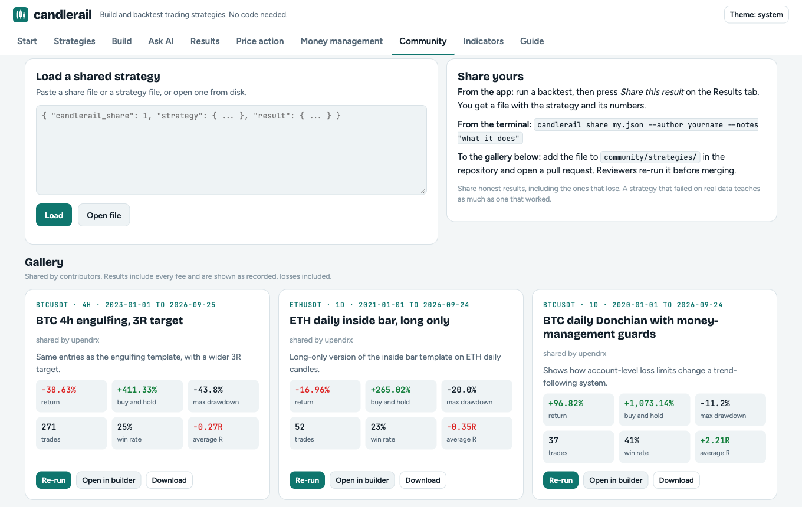

# Sharing strategies

A **share file** holds a strategy together with the result it produced:
which market, which period, and the headline numbers. Anyone can load it,
read it in plain English, and re-run the test to check the numbers.



## Making one

**In the app:** run a backtest, then press *Share this result* on the
Results tab. Add your name and a note if you like. The file downloads, and
you can copy it to the clipboard.

**In the terminal:**

```bash
candlerail share my-strategy.json --symbol ETHUSDT --interval 1d --from 2021-01-01 \
  --author yourname --notes "long-only inside bar on daily candles"
```

This runs the backtest and writes `<strategy name>.share.json`. It takes the
same market and data flags as `backtest`.

## The format

```json
{
  "candlerail_share": 1,
  "author": "yourname",
  "notes": "long-only inside bar on daily candles",
  "strategy": { ... the strategy file ... },
  "result": {
    "symbol": "ETHUSDT", "interval": "1d",
    "from": "2021-01-01 00:00", "to": "2026-09-24 00:00", "bars": 2093,
    "trades": 52, "return_pct": -16.96, "buy_hold_pct": 265.02,
    "max_drawdown_pct": 20.02, "win_rate_pct": 23.08, "profit_factor": 0.57,
    "sharpe": -0.76, "avg_r": -0.35, "fees_paid": 195.51,
    "starting_balance": 10000.0, "version": "0.1.0"
  }
}
```

`candlerail_share` is the format version. `from` and `to` are the first and
last candle's open times in UTC. Everywhere a strategy file is accepted (the
builder's *Open file*, the Ask AI tab, `candlerail backtest`,
`POST /api/check`), a share file works too: its `strategy` is used.

## Checking one

On the **Community** tab, paste a share file or open it, then press
*Re-run*. The app runs the same strategy on the same market, period and
starting balance, and compares:

- **Result reproduced** when the return is within 0.5 percentage points and
  the trade count matches.
- **The re-run differs** otherwise. Small differences can come from candle
  data the exchange revised, or a different candlerail version (see
  `result.version`). Large ones mean the recorded numbers can't be trusted.

From the terminal, `candlerail backtest shared.share.json --symbol ... --from ...`
does the same.

## Adding to the gallery

The gallery on the Community tab is built from
[`community/strategies/`](../community/strategies). To add yours:

1. Create the share file with `candlerail share` on Binance data, so anyone
   can reproduce it.
2. Put it in `community/strategies/`, named `<symbol>-<interval>-<idea>.share.json`.
3. Add it to `apps/cli/src/community.rs` and open a pull request.

Reviewers re-run every submission. Losing strategies are welcome: a result
that honestly shows an idea failing is as useful as one that worked. Results
tuned until they look good on one period (check the first-70% and last-30%
split) will be asked to show the out-of-sample numbers.
